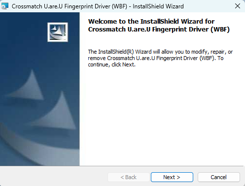
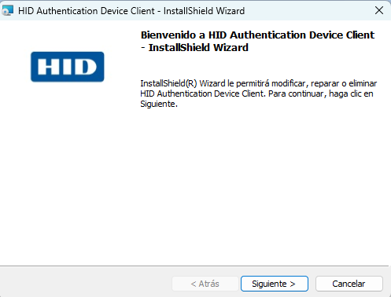
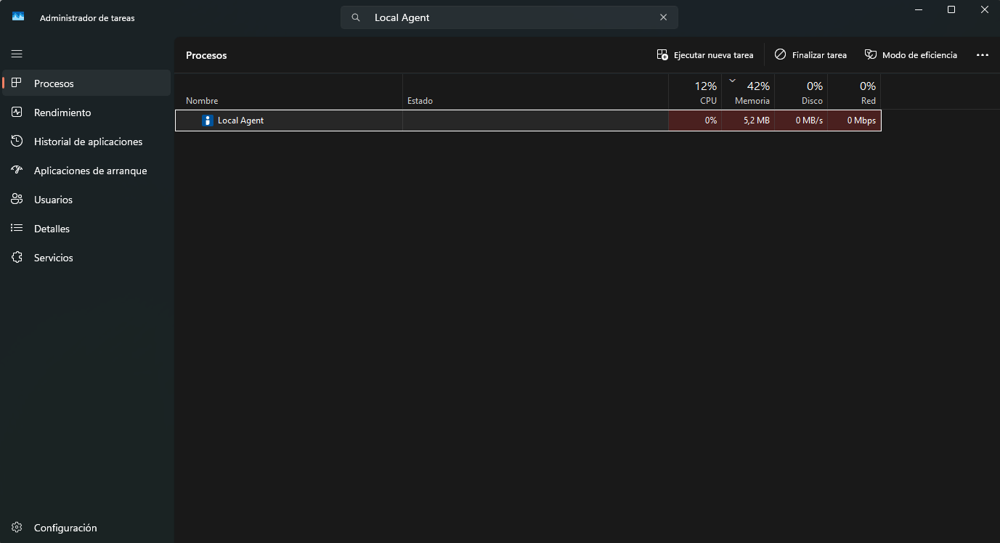
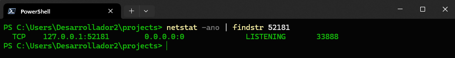
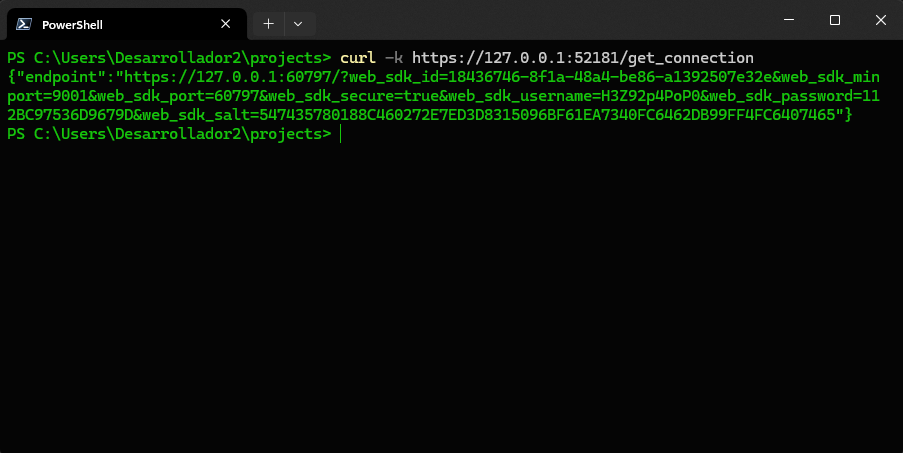
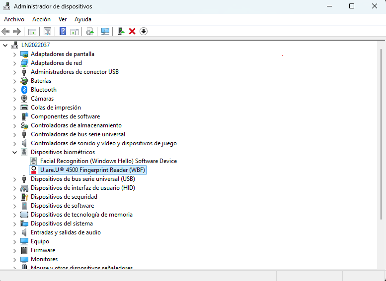

# Guía de Instalación - Biométrico Digital Persona U.are.U 4500

## **📋 Introducción**

El biométrico Digital Persona U.are.U 4500 es un lector de huellas dactilares que permite integrar funcionalidades de autenticación biométrica en aplicaciones web. Esta guía proporciona instrucciones detalladas para su instalación y configuración.

---

## **🖥️ Requisitos del Sistema**

### **⚙️ Requisitos Mínimos:**

- Sistema operativo: Windows 7 o superior
- .NET Framework 4.5 o superior
- Navegador web compatible (Chrome, Firefox, Edge)
- Puerto USB disponible
- Permisos de administrador para la instalación

### **⭐ Requisitos Recomendados:**

- Windows 10 o superior
- .NET Framework 4.8
- Navegador web actualizado con soporte HTTPS

---

## 🔧 **Proceso de Instalación**

### 🚀 **Paso 1: Preparación del Sistema**

> ⚠️ Importante: Asegúrese de tener permisos de administrador y cierre todas las aplicaciones que puedan interferir con el proceso.
> 

---

### 📦 **Paso 2: Instalación del Driver**

El driver es fundamental para el reconocimiento y funcionamiento básico del lector biométrico.

📥 **Descarga e instalación:**

1. Visite el sitio oficial: [https://www.hidglobal.com/drivers/39477](https://www.hidglobal.com/drivers/39477)
2. Descargue la versión más reciente del driver para Digital Persona U.are.U 4500
3. Ejecute el archivo de instalación como administrador
4. Siga las instrucciones del asistente de instalación



**⚙️ Configuración del Driver:**

1. Complete todos los pasos del asistente de instalación
2. Acepte los términos de licencia
3. Elija la ruta de instalación (se recomienda la ruta predeterminada)

---

### 🔄 **Paso 3: Reinicio del Equipo**

> 💡 Importante: Es necesario reiniciar el equipo para que los drivers se instalen correctamente.
> 

- 🔄 **Reinicie su equipo** después de completar la instalación del driver
- ⏳ Espere a que el sistema se inicie completamente antes de continuar

---

### 🌐 **Paso 4: Instalación de HID Authentication Device Client**

El HID Authentication Device Client es el componente que permite la integración con aplicaciones web.

📥 **Descarga:**

1. Acceda a: [https://crossmatch.hid.gl/lite-client](https://crossmatch.hid.gl/lite-client)
2. Descargue el paquete HID Authentication Device Client más reciente
3. Consulte la documentación oficial: [https://docs.hidglobal.com/digitalpersona-v4.2.0/ad/deploy/install-lite-client.htm](https://docs.hidglobal.com/digitalpersona-v4.2.0/ad/deploy/install-lite-client.htm)

### 🔧 **Instalación:**

1. **Ejecute el instalador como administrador** (botón derecho → "Ejecutar como administrador")
2. Seleccione el idioma de instalación
3. Acepte los términos de licencia
4. Elija la ruta de instalación (se recomienda la ruta predeterminada)
5. Seleccione los componentes a instalar
6. Complete la instalación siguiendo las instrucciones



---

### 🔍 **Paso 5: Verificación de Servicios**

> 💡 Importante: Es crucial verificar que todos los servicios estén ejecutándose correctamente.
> 

🎯 **Verificación en el Administrador de Tareas:**

- ⌨️ Presione **Ctrl + Shift + Esc** para abrir el Administrador de tareas
- 📋 Vaya a la pestaña **"Procesos"**
- 🔍 Busque **"Local Agent"** en la lista de procesos
- ✅ Confirme que el proceso **"Local Agent"** esté en ejecución



---

### 🛠️ **Paso 6: Verificación del Servidor Local**

El servicio debe estar ejecutándose en el puerto **52181** para permitir la comunicación con aplicaciones web.

#### **🔍 Verificar que el puerto esté en escucha:**

1. ⌨️ Presione **Windows + X** y seleccione **"Windows PowerShell (Administrador)"**
2. 💻 Ejecute el siguiente comando:

```powershell
netstat -ano | findstr 52181
```

3. ✅ Verifique que el estado sea **"LISTENING"**



#### **🌐 Verificar que el servidor responda:**

1. En la misma ventana de PowerShell, ejecute:

```powershell
curl -k https://127.0.0.1:52181/get_connection
```

2. ✅ El servidor debe responder con una conexión exitosa



---

### 🔌 **Paso 7: Conexión del Biométrico**

1. 🔌 **Conecte el lector biométrico** Digital Persona U.are.U 4500 a un puerto USB disponible
2. ⏳ Espere a que Windows reconozca automáticamente el dispositivo
3. 🔔 Verifique que aparezca una notificación de dispositivo conectado

---

### ✅ **Paso 8: Verificación del Dispositivo**

🎯 **Verificación en el Administrador de Dispositivos:**

1. ⌨️ Presione **Windows + R**
2. 💻 Escriba **"devmgmt.msc"** y presione Enter
3. 🔍 Busque la categoría de dispositivos biométricos o HID Global
4. ✅ Confirme que el dispositivo **Digital Persona U.are.U 4500** esté reconocido sin errores



---

## 🧪 **Pruebas y Verificación**

### 🌐 **Prueba con Repositorio de Ejemplo**

Para verificar que todo funcione correctamente, puede utilizar el siguiente repositorio de prueba:

📥 **Descarga del repositorio:**

1. 🔗 Visite: [https://github.com/shanxp/fingerprint-digital-persona-u-are-u-4500-web-example](https://github.com/shanxp/fingerprint-digital-persona-u-are-u-4500-web-example?tab=readme-ov-file)
2. 📦 Descargue o clone el repositorio
3. 📂 Abra el archivo **index.html** con su navegador web
4. ✍️ Siga las instrucciones para registrar y verificar una huella dactilar

### ✅ **Verificación de Funcionalidades**

**Pruebe las siguientes funciones:**

- 👆 **Captura de huella dactilar**
- 🎯 **Calidad de lectura**
- 📊 **Velocidad de reconocimiento**
- 🌐 **Integración con navegador**

---

## 🔧 **Solución de Problemas**

### 🚨 **Problemas Comunes y Soluciones**

#### ❌ **Problema 1: El "Local Agent" no está disponible en los procesos**

**Descripción:** El proceso "Local Agent" no aparece en el Administrador de tareas.

**Solución:**

1. 📂 Navegue a la ruta: `C:\Program Files\HID Global\Authentication Device Client\Bin`
2. 🖱️ Busque el archivo **DPAgent.exe**
3. 🖱️ Haga **clic derecho** y seleccione **"Ejecutar como administrador"**
4. ✅ Verifique en el Administrador de tareas que el proceso "Local Agent" esté activo

---

#### ⚠️ **Problema 2: El servidor no responde al comando curl**

**Descripción:** Al ejecutar `curl -k https://127.0.0.1:52181/get_connection` en PowerShell, el servicio no responde.

**Solución:**

1. ⌨️ Abra el **Administrador de tareas** (Ctrl + Shift + Esc)
2. 🔍 Busque el proceso **"Local Agent"**
3. 🖱️ Haga **clic derecho** y seleccione **"Finalizar tarea"**
4. 📂 Navegue a: `C:\Program Files\HID Global\Authentication Device Client\Bin`
5. 🖱️ Ejecute el archivo **DPAgent.exe** como administrador
6. ⏳ Espere unos segundos y vuelva a probar el comando curl

---

#### 🔧 **Problema 3: El puerto 52181 no está en estado LISTENING**

**Descripción:** Al ejecutar `netstat -ano | findstr 52181`, el servicio no está disponible o no aparece en estado LISTENING.

**Solución:**

1. ⌨️ Presione **Windows + R**
2. 💻 Escriba **"appwiz.cpl"** y presione Enter
3. 🔍 Busque **"HID Authentication Device Client"** en la lista
4. 🖱️ Haga **clic derecho** y seleccione **"Cambiar"** o **"Modificar"**
5. 🔧 Seleccione la opción **"Reparar"**
6. ⏳ Espere a que finalice el proceso de reparación
7. 🔄 Reinicie el equipo si es necesario
8. ✅ Verifique nuevamente con el comando netstat

---

#### 🚨 **El lector biométrico no es reconocido:**

**Solución:**

- Verifique que el cable USB esté conectado correctamente
- Pruebe con un puerto USB diferente (preferiblemente USB 2.0 o superior)
- Reinstale el driver del dispositivo
- Verifique en el Administrador de dispositivos si hay conflictos o errores

---

#### 🔐 **Problemas de permisos:**

**Solución:**

- Ejecute el navegador como administrador
- Verifique que el usuario tenga permisos para acceder al dispositivo
- Agregue excepciones en el firewall para el puerto 52181
- Verifique que el antivirus no esté bloqueando el servicio

---

## 📚 **Recursos y Enlaces Importantes**

### 🔗 **Enlaces de Descarga**

| Recurso | Enlace |
| --- | --- |
| 📦 **Driver Digital Persona** | [https://www.hidglobal.com/drivers/39477](https://www.hidglobal.com/drivers/39477) |
| 🌐 **HID Authentication Device Client** | [https://crossmatch.hid.gl/lite-client](https://crossmatch.hid.gl/lite-client) |
| 📚 **Documentación oficial** | [https://docs.hidglobal.com/digitalpersona-v4.2.0/ad/deploy/install-lite-client.htm](https://docs.hidglobal.com/digitalpersona-v4.2.0/ad/deploy/install-lite-client.htm) |
| 🧪 **Repositorio de prueba** | [https://github.com/shanxp/fingerprint-digital-persona-u-are-u-4500-web-example](https://github.com/shanxp/fingerprint-digital-persona-u-are-u-4500-web-example?tab=readme-ov-file) |

### 💻 **Comandos Útiles**

| Comando | Función |
| --- | --- |
| `Windows + R` → `devmgmt.msc` | 🔧 Abrir Administrador de dispositivos |
| `Windows + R` → `appwiz.cpl` | 📦 Abrir Programas y características |
| `netstat -ano \| findstr 52181` | 🔍 Verificar puerto del servicio |
| `curl -k https://127.0.0.1:52181/get_connection` | 🌐 Probar conexión con el servicio |

### 📂 **Rutas Importantes**

| Ruta | Descripción |
| --- | --- |
| `C:\Program Files\HID Global\Authentication Device Client\Bin` | 📁 Ubicación del ejecutable DPAgent.exe |

---

## 📝 **Notas Finales**

- 🔒 El servicio utiliza **HTTPS** en el puerto **52181** para garantizar comunicaciones seguras
- 🔄 Si experimenta problemas persistentes, considere desinstalar completamente ambos componentes y realizar una instalación limpia
- 💡 Mantenga siempre actualizado el software del fabricante para obtener las últimas mejoras de seguridad y rendimiento
- 📧 Para soporte adicional, consulte la documentación oficial de HID Global

---

**✅ Instalación completada exitosamente**

Si ha seguido todos los pasos correctamente, su lector biométrico Digital Persona U.are.U 4500 debería estar completamente funcional y listo para integrarse con sus aplicaciones web.

