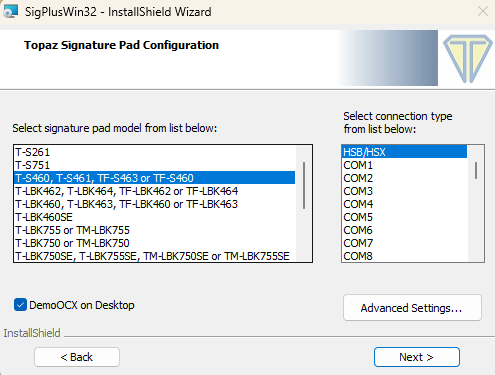
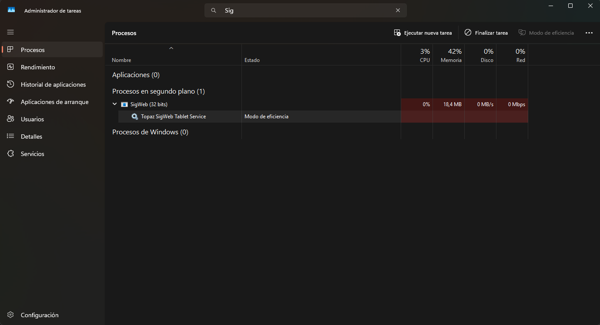
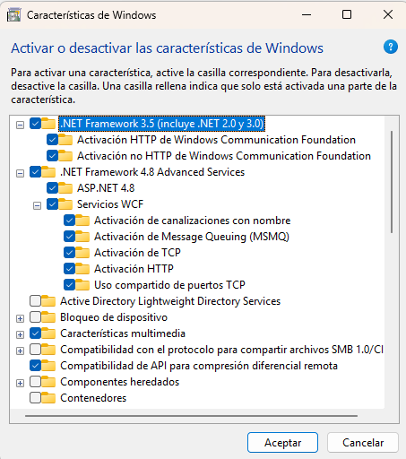
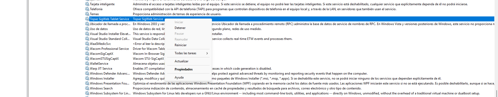

# Guía de Instalación - Tablet Topaz T-S460-HSB-R

## **📋 Introducción**

La tablet Topaz T-S460-HSB-R es un dispositivo de captura de firmas digitales que permite integrar funcionalidades de firma electrónica en aplicaciones web. Esta guía proporciona instrucciones detalladas para su instalación y configuración.

---

## **🖥️ Requisitos del Sistema**

### **⚙️ Requisitos Mínimos:**

- Sistema operativo: Windows 7 o superior
- .NET Framework 4.5 o superior
- Navegador web compatible (Chrome, Firefox, Edge, Internet Explorer)
- Puerto USB disponible
- Permisos de administrador para la instalación

### **⭐ Requisitos Recomendados:**

- Windows 10 o superior
- .NET Framework 4.8
- Navegador web actualizado

---

## 🔧 **Proceso de Instalación**

### 🚀 **Paso 1: Preparación del Sistema**

> ⚠️ Importante: Asegúrese de tener permisos de administrador y cierre todas las aplicaciones que puedan interferir con el proceso.
> 

### 📦 **Paso 2: Instalación del Driver SigPlus**

El driver SigPlus es fundamental para el reconocimiento y funcionamiento básico de la tablet.

📥 **Descarga e instalación:**

1. Visite el sitio oficial: [https://www.sigpluspro.com/sigplus.html](https://www.sigpluspro.com/sigplus.html)
2. Descargue la versión más reciente del SigPlus Driver
3. Ejecute el archivo de instalación como administrador
4. Siga las instrucciones del asistente de instalación
    
    1️⃣ **Selección del modelo:**
    
    - Busque y seleccione “T-S460, T-S461, T-S463 o T-S460” en la lista
    - Si no aparece, seleccione el modelo más similar de la serie T-LBK
    
    2️⃣ **Tipo de conexión:**
    
    - Seleccione “USB-HID” como tipo de conexión
    - Confirme que el puerto USB está disponible
    
    
    

**⚙️ Configuración SigPlus:**

1. Conecte la tablet al puerto USB cuando se le solicite
2. Espere a que Windows reconozca automáticamente el dispositivo

---

### 🌐 **Paso 3: Instalación de SigWeb**

SigWeb es el componente que permite la integración con aplicaciones web.

📥 **Descarga:**

1. Acceda a: [https://topazsystems.com/sdks/sigweb.html](https://topazsystems.com/sdks/sigweb.html)
2. Descargue el paquete SigWeb más reciente
3. Consulte la guía oficial en español: [https://www.topazsystems.com/software/sigweb_install_SPA.pdf](https://www.topazsystems.com/software/sigweb_install_SPA.pdf)

### 🔧 **Instalación:**

1. **Ejecute el instalador como administrador** (botón derecho → "Ejecutar como administrador")
2. Seleccione el idioma de instalación
3. Acepte los términos de licencia
4. Elija la ruta de instalación (se recomienda la ruta predeterminada)
5. Seleccione los componentes a instalar
6. Complete la instalación siguiendo las instrucciones
7. **Pruebe la funcionalidad** en la demo oficial: [www.sigplusweb.com/sigwebtablet_demo.htm](http://www.sigplusweb.com/sigwebtablet_demo.htm)

---

### 🔍 **Verificación de Servicios**

> 💡 Importante: Es crucial verificar que todos los servicios estén ejecutándose correctamente.
> 

🎯 **Verificación en el Administrador de Tareas:**

- ⌨️ Presione **Ctrl + Shift + Esc** para abrir el Administrador de tareas
- 📋 Vaya a la pestaña **"Procesos"**
- 🔍 Busque **"SigWeb"** en la lista de procesos
- ✅ Confirme que **"Topaz SigWeb Tablet Service"** esté en ejecución

### 🛠️ **Verificación en Servicios de Windows:**

- ⌨️ Presione **Windows + R**
- 💻 Escriba **"services.msc"** y presione Enter
- 🔍 Busque **"Topaz SigWeb Tablet Service"**
- ✅ Verifique que el estado sea **"En ejecución"**
- 🔄 Confirme que el tipo de inicio sea **"Automático"**

---

## 🔧 **Configuración de .NET Framework**

🔍 **Verificación de .NET Framework**

- ⌨️ Presione **Windows + R**
- 💻 Escriba **"appwiz.cpl"** y presione Enter
- 🔘 Haga clic en **"Activar o desactivar las características de Windows"**
- ✅ Verifique que estén activas las siguientes características:

🔧 Componente

- 🔧 **.NET Framework 4.5 Advanced Services**
- 🌐 **ASP.NET 4.8**
- 🔄 **Servicios WCF**
- 🌐 **Activación HTTP de Windows Communication Foundation**

---

## 🧪 **Pruebas y Verificación**

### 🌐 **Prueba con Demo Online**

- 🌐 Abra su navegador web
- 🔗 Visite: [www.sigplusweb.com/sigwebtablet_demo.htm](http://www.sigplusweb.com/sigwebtablet_demo.htm)
- 📋 Siga las instrucciones en pantalla para probar la funcionalidad
- ✍️ Realice una firma de prueba para verificar el correcto funcionamiento

### ✅ **Verificación de Funcionalidades**

**Pruebe las siguientes funciones:**

- ✍️ **Captura de firma**
- 🎨 **Calidad de trazado**
- 📊 **Sensibilidad de presión**
- 🌐 **Integración con navegador**

## 🔧 **Solución de Problemas**

### 🚨 **Problemas Comunes y Soluciones**

❌ **La tablet no es reconocida:**

- Verifique que el cable USB esté conectado correctamente
- Pruebe con un puerto USB diferente
- Reinstale el driver SigPlus
- Verifique en el Administrador de dispositivos si hay conflictos

⚠️ **El servicio SigWeb no se inicia:** 

- Abra services.msc como administrador
- Busque “Topaz SigWeb Tablet Service”
- Haga clic derecho y seleccione “Reiniciar”
- Si persiste el problema, cambie el tipo de inicio a “Manual” y luego a “Automático”

🔧 **Error de .NET Framework:** 

- Verifique que esté instalada la versión correcta
- Repare la instalación de .NET Framework
- Ejecute Windows Update para obtener las últimas actualizaciones

🔐 **Problemas de permisos:**

- Ejecute el navegador como administrador
- Verifique que el usuario tenga permisos para acceder al dispositivo
- Agregue excepciones en el firewall si es necesario

---

### 🔄 **Reinicio de Servicios**

**Proceso paso a paso:**

1. ⌨️ Presione **Windows + R**
2. 💻 Escriba **"services.msc"**
3. 🔍 Busque **"Topaz SigWeb Tablet Service"**
4. 🖱️ Haga **clic derecho** sobre el servicio
5. 🔄 Seleccione **"Reiniciar"**
6. ⏳ Espere a que el servicio se reinicie completamente
7. ✅ Verifique que el estado sea **"En ejecución"**

---

## 📚 **Recursos y Enlaces Importantes**

### 🔗 **Enlaces de Descarga**

| Recurso | Enlace |
| --- | --- |
| 📦 **SigPlus Driver** | [https://www.sigpluspro.com/sigplus.html](https://www.sigpluspro.com/sigplus.html) |
| 🌐 **SigWeb SDK** | [https://topazsystems.com/sdks/sigweb.html](https://topazsystems.com/sdks/sigweb.html) |
| 📚 **Guía oficial** | [https://www.topazsystems.com/software/sigweb_install_SPA.pdf](https://www.topazsystems.com/software/sigweb_install_SPA.pdf) |
| 🧪 **Demo de prueba** | [www.sigplusweb.com/sigwebtablet_demo.htm](http://www.sigplusweb.com/sigwebtablet_demo.htm) |

### 💻 **Comandos Útiles**

| Comando | Función |
| --- | --- |
| `Windows + R` → `services.msc` | 🔧 Abrir servicios |
| `Windows + R` → `appwiz.cpl` | 📦 Abrir programas instalados / 🔧 Características de Windows |
